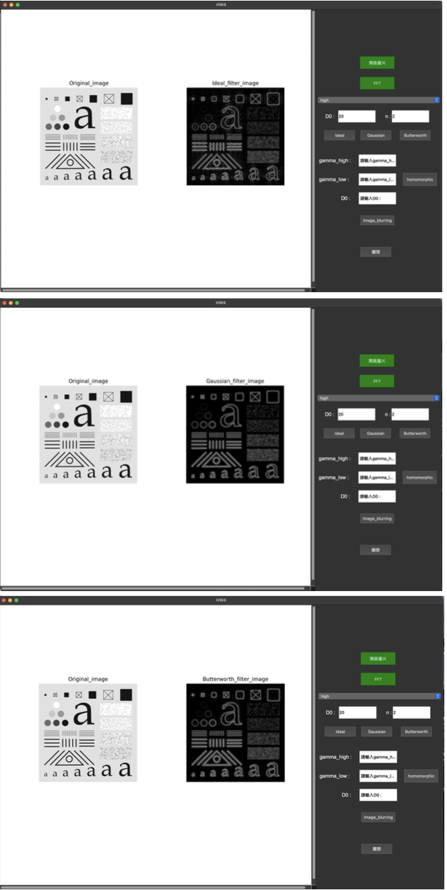
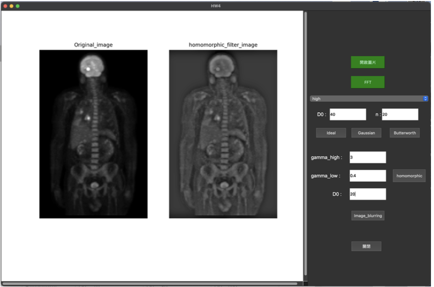
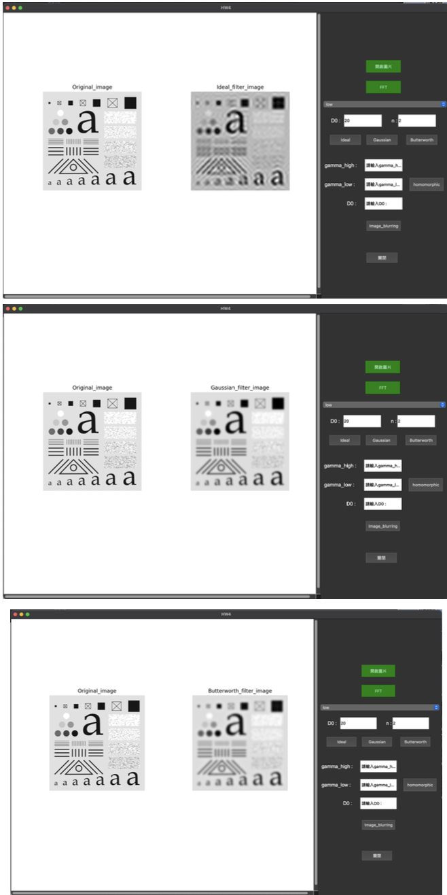

# HW4 Image Processing Application

This is an image processing application built using PyQt5 that allows users to perform various frequency-domain filtering operations on images. It provides an interface to open images and apply several filters, such as Ideal, Butterworth, Gaussian, and Homomorphic filtering.

## Features

- **Open Image**: Load an image from your system and display it in the application window.
- **FFT (Fast Fourier Transform)**: Apply FFT to the image and display the frequency-domain representation.
- **Ideal Filter**: Apply an Ideal filter to the image. The user can specify the cutoff frequency (D0) and choose between a low-pass or high-pass filter.
- **Butterworth Filter**: Apply a Butterworth filter to the image. The user can specify the cutoff frequency (D0) and the order (n), and choose between a low-pass or high-pass filter.
- **Gaussian Filter**: Apply a Gaussian filter to the image. The user can specify the cutoff frequency (D0) and choose between a low-pass or high-pass filter.
- 
- **Homomorphic Filter**: Apply a Homomorphic filter to the image for image enhancement.
- 
- **Image Blurring**: Apply a blurring effect to the image.
- 
- **Exit**: Close the application.

## Requirements

- Python 3.x
- PyQt5
- OpenCV
- NumPy
- Matplotlib

You can install the required libraries using `pip`:

```bash
pip install pyqt5 opencv-python numpy matplotlib
```

## Usage

1. Open the application.
2. Click on the "Open Image" button to load an image.
3. After loading the image, apply the desired filter using the corresponding buttons. You can modify the filter parameters such as D0 (cutoff frequency) and n (order of the filter) before applying the filters.
4. Use the FFT option to view the frequency-domain representation of the image.
5. To close the application, click on the "Close" button.

## Example of Filters

- **Ideal Filter**: Low-pass or high-pass filter with a cutoff radius specified by D0.
- **Butterworth Filter**: A smoother transition compared to the Ideal filter, with customizable cutoff frequency and order.
- **Gaussian Filter**: Smooths the image using a Gaussian function, with low-pass or high-pass options.
- **Homomorphic Filter**: Enhances the image by modifying the frequency domain for better contrast and sharpness.

## File Structure

```
├── HW4App.py      # The main application code
└── resources/     # Folder for additional resources, if needed
```
